# Detecting Pneumonia - Chest X-Ray Images

The project uses transfer learning from a pre-trained [DensNet201](https://github.com/pytorch/vision/blob/6db1569c89094cf23f3bc41f79275c45e9fcb3f3/torchvision/models/densenet.py#L126) 
network to classify [chest X-ray](https://data.mendeley.com/datasets/rscbjbr9sj/2) images into one of three classes- normal, bacteria, or virus. In a DenseNet, we use 
dense connections between layers, using Dense Blocks, where each layer (with identical feature maps) directly connects 
with each other through dense connections.

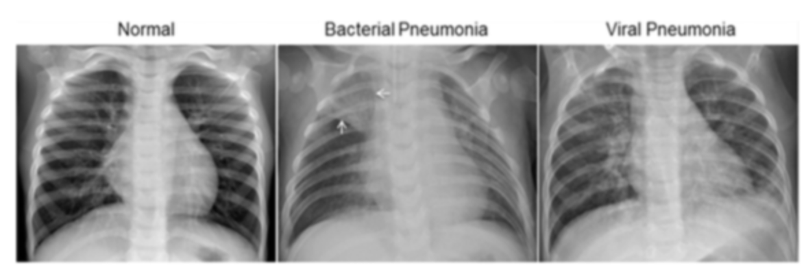

On the left panel of the chest X-ray (normal), the lungs appear clear with no abnormal opacification. A bacterial 
pneumonia (middle) is typically characterized by a focal consolidation, in this case in the right upper lobe 
(white arrow), whereas a viral pneumonia (right) shows a diffuse, ''interstitial'' pattern throughout both lungs.

**Tensorleap** helps to explore the latent space of a dataset and find new and important insights. It can also be used
to find unlabeled clusters or miss-labeling in the dataset in the most efficient way.

Initially, we approached the problem as a binary classification problem, with 1583 images in the "normal" class and 4017
images in the "phenomena" class, resulting in imbalanced data. We attempted to utilize a pre-trained YOLOv8 model without
further training. When examining the latent space, it becomes apparent that the model displayed clear indications of overfitting. 
Each dot in the latents pace represents a sample. In this case, the color and the size of the dot represents the loss value; 
the bigger and darker the point, the larger the loss.
Upon examining the subset of samples belonging to the "PNEUMONIA" class, it became evident that the model consistently 
made correct predictions. However, when focusing on the subset of samples from the "NORMAL" class, the model 
consistently produced incorrect predictions

<div style="display: flex">
  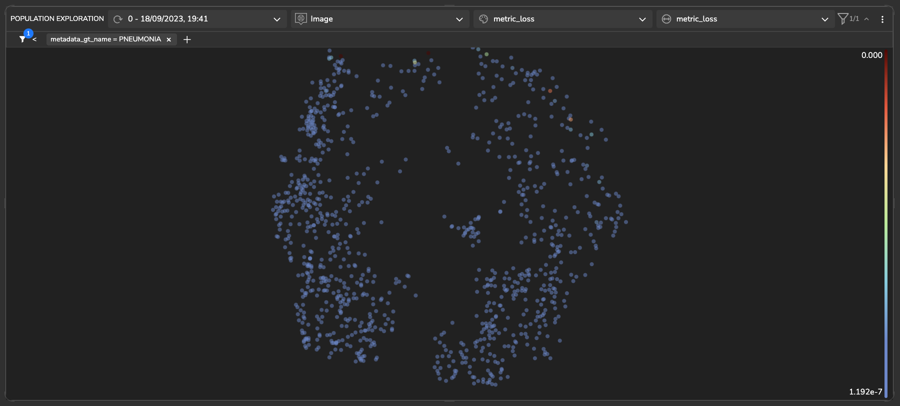
  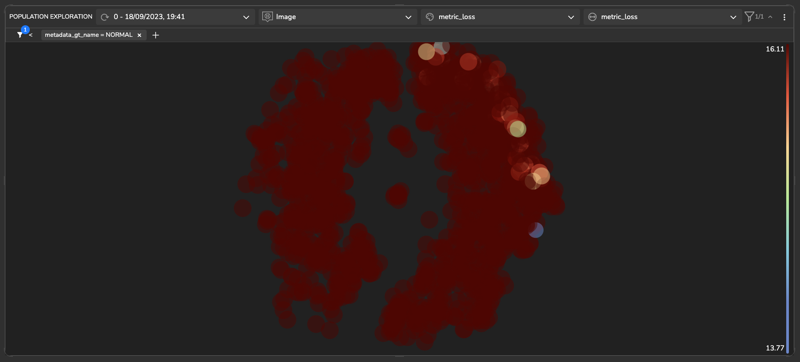
</div>

Subsequently, we explored the development of a relatively straightforward CNN network. It is apparent that the network 
learned, albeit not effectively. Tensorleap heatmaps demonstrate showed lack of correct and pertinent feature learning, indicating 
a relatively inaccurate network performance.

<div style="display: flex">
  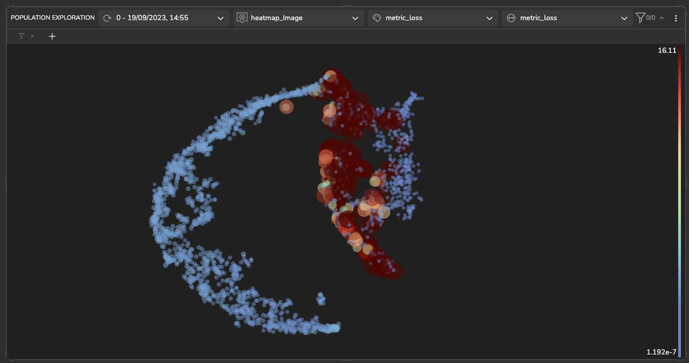
  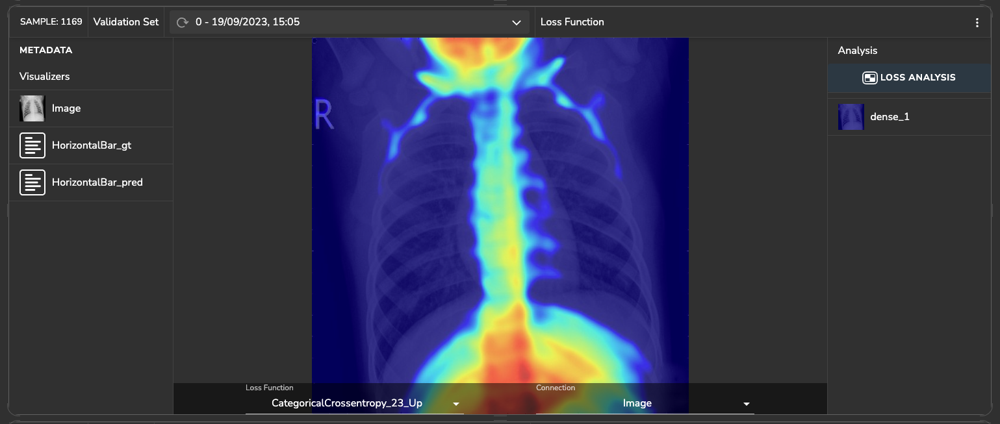
</div>

At this point, we decided to change the problem to multiple classes, including "normal", 
"bacteria", and "virus" categories.
This adjustment was made to achieve a more balanced dataset. Moreover, the distinction between 
"bacteria" and "normal" appears to be less complex than that between "virus" and "normal," or "virus" and "bacteria." 
Therefore, there's a possibility that the model's performance will improve under these new conditions.
Additionally, we made the decision to train the model on various pre-trained networks, including DenseNet201, using 
transfer-learning techniques. These networks were evaluated using several metrics, 
many of which address the challenges posed by imbalanced data. DensNet201 had the best performance overall.

### Latent Space Exploration

#### *Clusters Separation*

The following plot illustrates a population exploration map, depicting the similarity among samples based on the latent 
space of a trained model. This map is constructed using the extracted features of the model.

In the latent space, each dot represents a sample. In this case, the color represents the ground truth value of the 
sample, and the size of the dot represents the loss value; the bigger the point, the larger the loss. As can be seen, 
there is a relatively good separation between images that represent a patient with a phenomenon and those that represent
a patient without. In other words, samples representing healthy people share similar features, as do images of patients. 
There is, however, some overlap between the two, suggesting that the separation is not totally absolute.

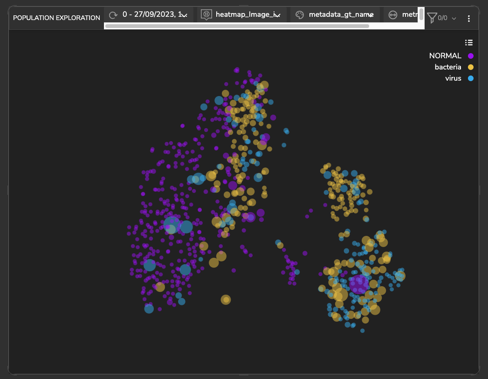


#### *Common Features*

##### pixels values

Upon further investigation, it becomes clear that the two smaller groups are further separated. The images in the lower 
right group have a relatively large number of pixels representing a bright, almost white color (223). Compared to the 
upper right group in which the number of pixels with a value of 199 is greater.

<div style="display: flex">
  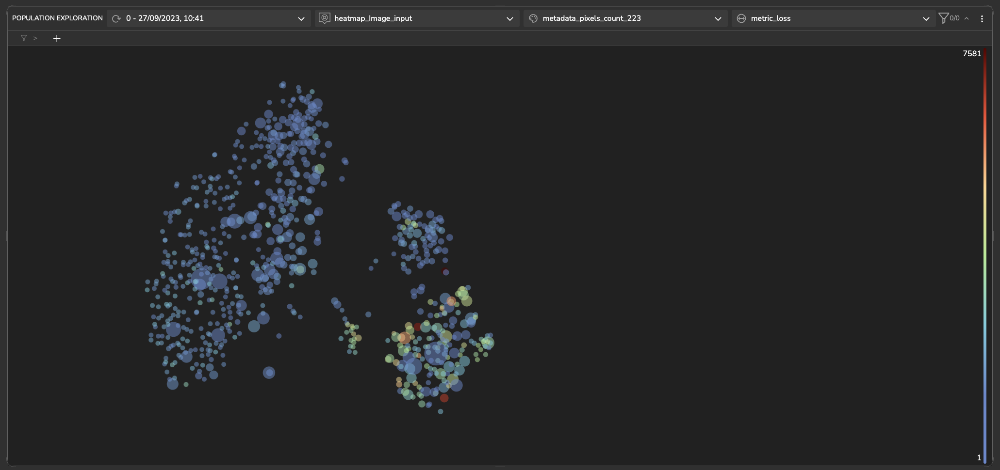
  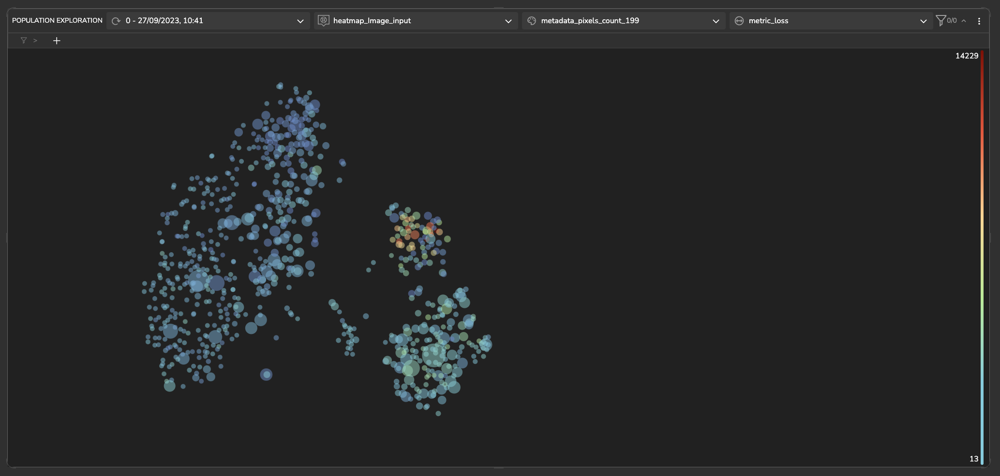
</div>

Noticeably, in the upper right group, the images exhibit a higher average pixel value, signifying greater brightness. 
This corresponds to a larger number of pictures representing bacteria, which is in line with our expectations. 

<div style="display: flex">
  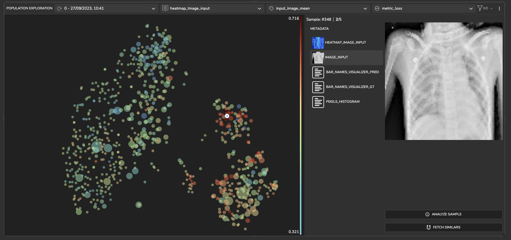
  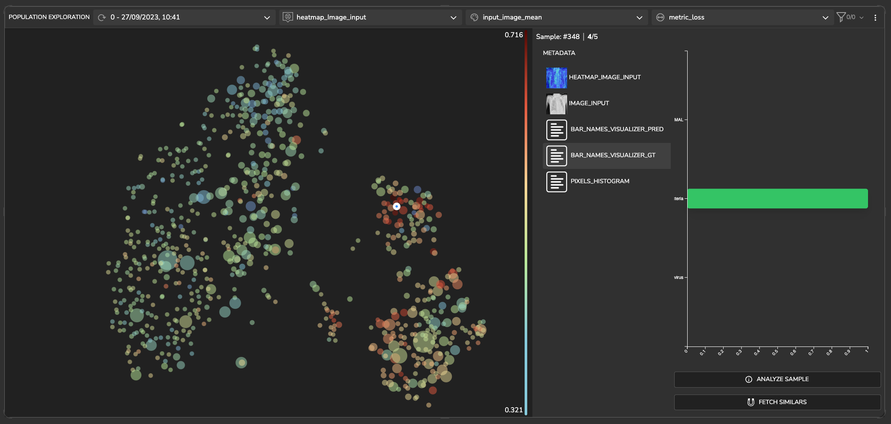
</div>

Conversely, in the lower group, we observe a higher standard deviation in pixel values, indicating more significant 
variation in image brightness

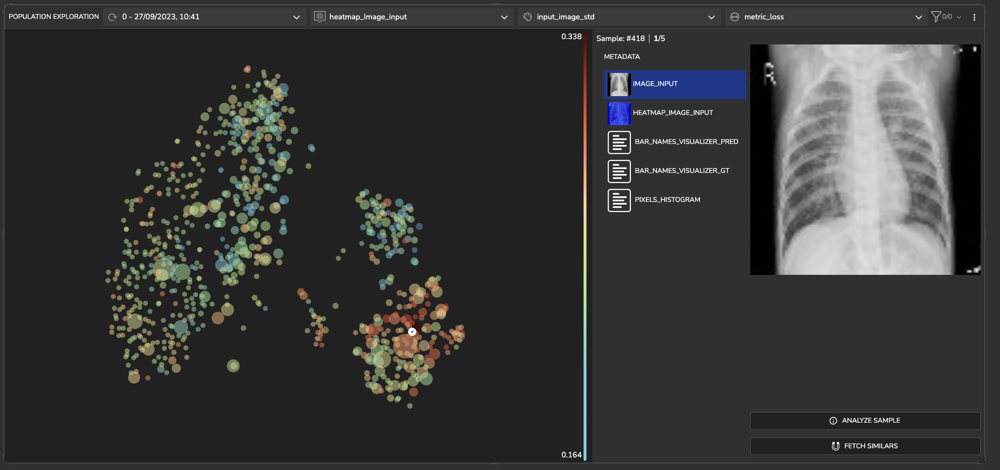

#### *Detecting High Loss Clusters*

U sing fetch similar a set of samples exhibiting elevated loss (darker color and larger size) was detected. 
Upon closer investigation, it becomes apparent that these samples correspond to instances where the ground truth 
indicates bacteria, but the model's prediction suggests a viral presence.

<div style="display: flex">
  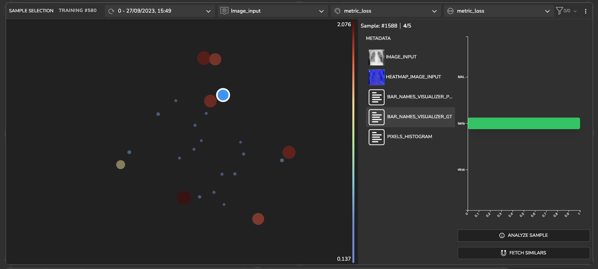
  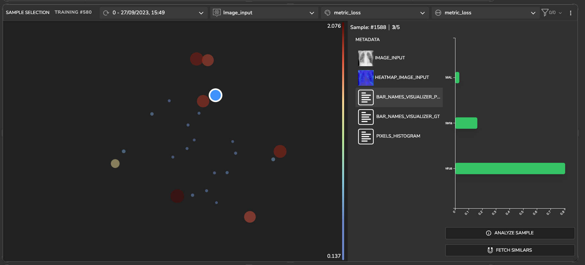
</div>

### Sample Loss Analysis

Within this section, we delve into the examination of features that impact the model's predictions. 
Tensorleap automatically generates a heatmap that quantifies the effect different features have on loss/ specific prediction.
In the image depicted below, the heat map displays warmer areas, indicating regions in the image where features are more
prominent. The displayed image depicts a patient with a bacterial pneumonia, identifiable by a localized consolidation, 
as seen in this instance in the right upper lobe (indicated by the green arrow). 
The warmer coloration in the 'bacteria up' prediction at the same location indicates the likelihood that the image is 
classified as representing a bacterial infection, highlighting the distinctive features associated with this classification.

<div style="display: flex">
  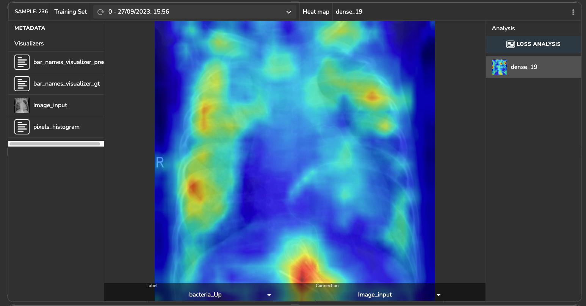
  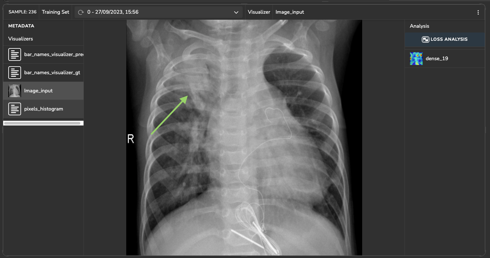
</div>


# Getting Started with Tensorleap Project

This quick start guide will walk you through the steps to get started with this example repository project.

## Prerequisites

Before you begin, ensure that you have the following prerequisites installed:

- **[Python](https://www.python.org/)** (version 3.7 or higher).
- **[Poetry](https://python-poetry.org/)**.
- **[Tensorleap](https://tensorleap.ai/)** platform access. To request a free trial click [here](https://meetings.hubspot.com/esmus/free-trial).
- **[Tensorleap CLI](https://github.com/tensorleap/leap-cli)**.


## Tensorleap **CLI Installation**

with `curl`:

```
curl -s https://raw.githubusercontent.com/tensorleap/leap-cli/master/install.sh | bash
```

## Tensorleap CLI Usage

### Tensorleap **Login**

To login to Tensorleap:

```
tensorleap auth login [api key] [api url].
```

- API Key is your Tensorleap token (see how to generate a CLI token in the section below).
- API URL is your Tensorleap environment URL: https://api.CLIENT_NAME.tensorleap.ai/api/v2

<br>

**How To Generate CLI Token from the UI**

1. Login to the platform in 'CLIENT_NAME.tensorleap.ai'
2. Scroll down to the bottom of the **Resources Management** page, then click `GENERATE CLI TOKEN` in the bottom-left corner.
3. Once a CLI token is generated, just copy the whole text and paste it into your shell.


## Tensorleap **Project Deployment**

To deploy your local changes:

```
leap project push
```

### **Tensorleap files**

Tensorleap files in the repository include `leap_binder.py` and `leap.yaml`. The files consist of the  required configurations to make the code integrate with the Tensorleap engine:

**leap.yaml**

leap.yaml file is configured to a dataset in your Tensorleap environment and is synced to the dataset saved in the environment.

For any additional file being used, we add its path under `include` parameter:

```
include:
    - leap_binder.py
    - healthcare/configs.py
    - [...]
```

**leap_binder.py file**

`leap_binder.py` configures all binding functions used to bind to Tensorleap engine. These are the functions used to evaluate and train the model, visualize the variables, and enrich the analysis with external metadata variables

## Testing

To test the system we can run `leap_test.py` file using poetry:

```
poetry run test
```

This file will execute several tests on leap_binder.py script to assert that the implemented binding functions: preprocess, encoders,  metadata, etc.,  run smoothly.

*For further explanation please refer to the [docs](https://docs.tensorleap.ai/)*


